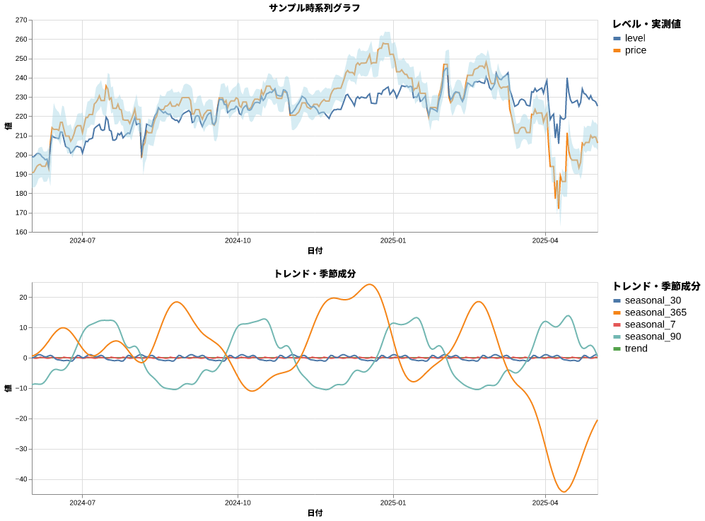
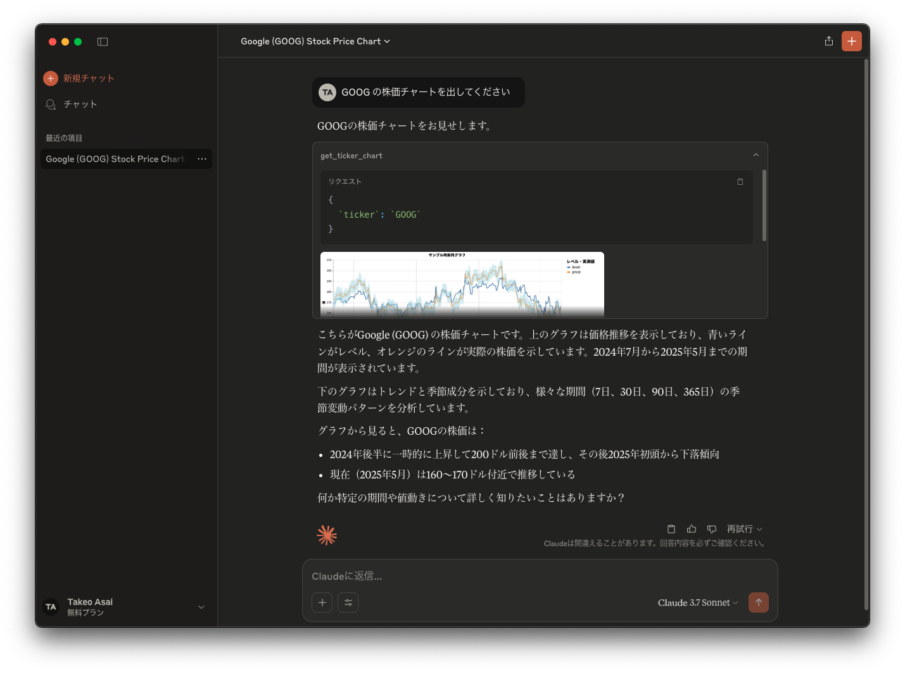

# MCP create timeseries chart

> [!NOTE]
> `2025/05/04` 時点では VSCode の GitHub Copilot Chat の Agent Mode で画像表示できない。代わりに Claude Desktop などを利用して確認すること。




<details>
<summary>Example: Claude Desktop</summary>

### `claude_desktop_config.json`

```json
{
    "mcpServers": {
        "stack": {
            "command": "docker",
            "args": [
                "run",
                "-i",
                "--rm",
                "spitson/mcp-create-timeseries-chart"
            ]
        }
    }
}
```

### Screenshot



</details>
